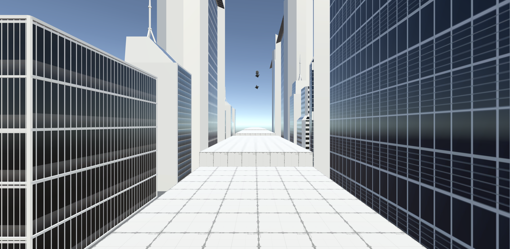

# VR Endless Runner 

Welcome! This is the repository for my master's degree final project. Here you can find a VR endless runner. The main purpose of this is to explore some specific mechanics that games can use to create an immersive, motion-sickness-free experience: locomotion through hand movements and narrowing of the visual field dynamically on impact.

## Download 
You can download the game from [Releases](https://github.com/marius7122/VR-EndlessRunner/releases) section.

The game is tested on Windows using Oculus Quest 2. In order to play the game you have to do the following:
1. Make sure you have the last version of Oculus installed
2. Connect your Oculus Quest 2 to your PC
3. Open the Oculus app
4. Enable Oculus Link
5. Launch the game executable
6. Enjoy!

The controls are simple: 
* to run you should press B (on the right controller) and Y (on the left controller) and swing your arm like you were running
* your direction of movement is given by your hand position
* to jump you should quickly raise your hands above your head like you were jumping

## Development setup
1. Clone the project `git clone --depth 1 https://github.com/marius7122/VR-EndlessRunner/`
2. Open the project with Unity 2021 LTS

The project is structured in such a way that you can use almost any component in another project. I encourage you to borrow components and use them in your project (please contact me to show your amazing project :D).

## Contact
You can reach me at cilteamarian@gmail.com.